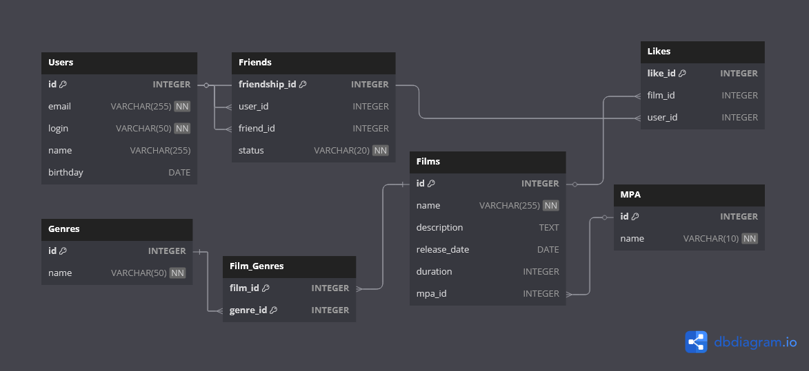

# Промежуточное ТЗ 12 Спринта


# Примеры запросов

## Топ N наиболее популярных фильмов
```sql
SELECT f.id, f.name, COUNT(l.like_id) AS likes_count
FROM Films f
LEFT JOIN Likes l ON f.id = l.film_id
GROUP BY f.id
ORDER BY likes_count DESC
LIMIT N;
```
Где N - необходимое количество популярных фильмов

## Список общих друзей с другим пользователем:
```sql
SELECT u2.id, u2.name
FROM Friends f1
JOIN Friends f2 ON f1.friend_id = f2.friend_id
JOIN Users u2 ON f2.friend_id = u2.id
WHERE f1.user_id = user1_id 
  AND f2.user_id = user2_id
  AND f1.status = 'CONFIRMED'
  AND f2.status = 'CONFIRMED';
```

## Получение рейтинга фильма:
```sql
SELECT f.id, f.name, m.name AS mpa_rating
FROM Films f
JOIN MPA m ON f.mpa_id = m.id;
```

# Небольшое пояснение
Таблица Film_Genres нужна для реализации связи "многие ко многим" между фильмами (Films) и жанрами (Genres). Это позволяет одному фильму принадлежать к нескольким жанрам, а одному жанру — включать в себя множество фильмов.
